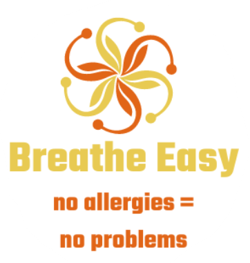

# "Breathe easy" - Enjoy the spring blossom as never before!


<p align="center">

</p>

This repo provides the essential information on the "Breathe Easy" project - app for the aerial allergens tracking. 

### 🔥 Main features of our app:
* up-to-date data from the closest monitoring station to your geoposition
* life alerts from people neadby with the same allergy
* personalized tips and advises from the health experts


You can find Software Requirements Specification file for our app in the *dev_docs* folder. 

## 💬 Contact information

* [Anna Chechenina](mailto:anna.chechenina@alum.esci.upf.edu?subject=[GitHub]%20Source%20Han%20Sans)
* [Yvette Dimitrova](mailto:yvette.dimitrova@alum.esci.upf.edu?subject=[GitHub]%20Source%20Han%20Sans)
* [Stafano Galiano](mailto:stefano.galiano@alum.esci.upf.edu?subject=[GitHub]%20Source%20Han%20Sans)

🚀  To **contribute** to our project, please contact us. 
You can also fork this repo and work remotely under your own version. 

To clone this repo use this command:

```console
$  git clone https://github.com/checheanya/Allergy_Software_ESCI/
```

## License

Licensed under the MIT License, Copyright © 2023

> Software Development course, ESCI 2023
